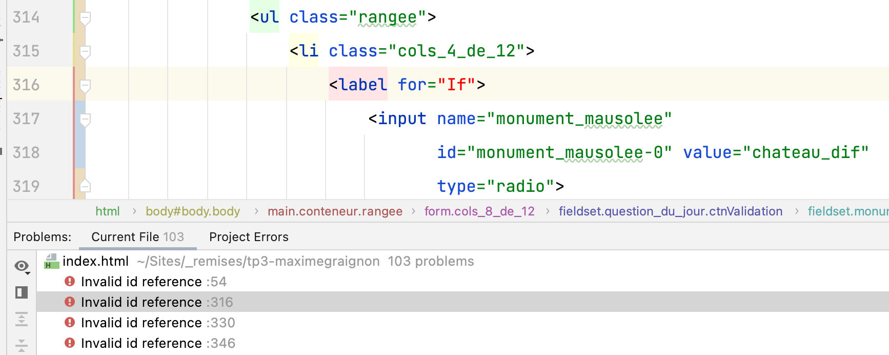

_# Grille d'évaluation pour le TP3
## Structure, sémantique, accessibilité, API des formulaires HTML5
- [X] __Regrouper les éléments de formulaire de même nature__ (.75/1 point)
    - Utiliser des `<fieldsets>`
    - Faire des groupes d’`<option>`s dans une liste déroulante
- [X] __Étiqueter__ (.65/1 point)
    - Étiqueter les groupes d’éléments de formulaire
    - Nommer chaque groupe avec une `<legend>`
    - Étiqueter un groupe d’`<option>`s d’une liste déroulante
    - Étiqueter avec un `<label>` les champs de formulaire
- [X] __Tester l'accessibilité__ (.85/1 point)
    - Rendre (garder) le formulaire navigable au clavier
    - Baliser avec précision les éléments de formulaire
    - Bien choisir le type du `<input>`
    - Code sémantique et valide pour l’ensemble du document
- [X] __Ajouter des containtes de saisie__ (.85/1 point)
    - Identifier par un attribut approprié les champs obligatoires du formulaire
    - Ajouter des contraintes de saisie sur les champs de formulaire

## Styles CSS
- [X] __Aligner les éléments de formulaire__ (.75/1 point)
    - Contrôler les espacements
- [X] __Intégrer tous les contenus__  (.75/1 point)
    - Selon les guides visuels (ou mieux !)
- [X] __Styler l’interactivité__  (.65/1 point)
    - État focus, état checked des éléments de formulaires
    - États des hyperliens (link, visited, hover, active)
    - Styler les messages d’erreur
    - Utiliser des sprites CSS
- [X] __Styler les boutons radio__  (.65/1 point)
    - en les gardant accessibles au clavier

## Méthodes de travail favorisant la collaboration
- [X] __Organiser et documenter la feuille de styles__  (.85/1 point)
- [X] __Utiliser le contrôle des versions GIT__  (1 point)
    - Un minimum de 3 commits est attendu pour les étapes html, css, contrôle qualité finale

## Note et commentaires
 7.75/10 

- Les regroupements d'options dans les listes déroulantes sont défectueux car la balise de fermeture `</optgroup>` n'est pas placée __après__ les options qu'elle est sensé regrouper. 
- Voir les corrections suggérées dans le code du commit.

### HTML
- Plusieurs [erreurs html](images/erreurs-html.png)
  - La liste des boutons radio n'était pas refermée manquait `</ul>` 
  - L'étiquetage est défectueux sur 4 éléments de formulaire: le prénom, et les 3 boutons radio.
  La valeur de l'attribut `for` doit être la valeur du `id` de l'élément de formulaire
  
- Pour le champ de saisie de l'adresse, le `type="number"`ne permet pas d'entrer une adresse complète. Il faut choisir `type="text"` et ajouter un attribut `pattern`

### CSS
- Utiliser la classe `visuallyhidden` pour cacher les boutons radio tout en les gardant accessibles pour le lecteur d'écran
- Le sélecteur de frère adjacent `[type=radio]+label` ne peut pas fonctionner si le `<input>` est placé dans la balise `label>`  

## Barème
| Barème | sur 1 |
|--------|-------|
| A+     | 1     |
| A      | 0.95  |
| B+     | 0.9   |
| B      | 0.85  |
| C+     | 0.8   |
| C      | 0.75  |
| D      | 0.65  |_
